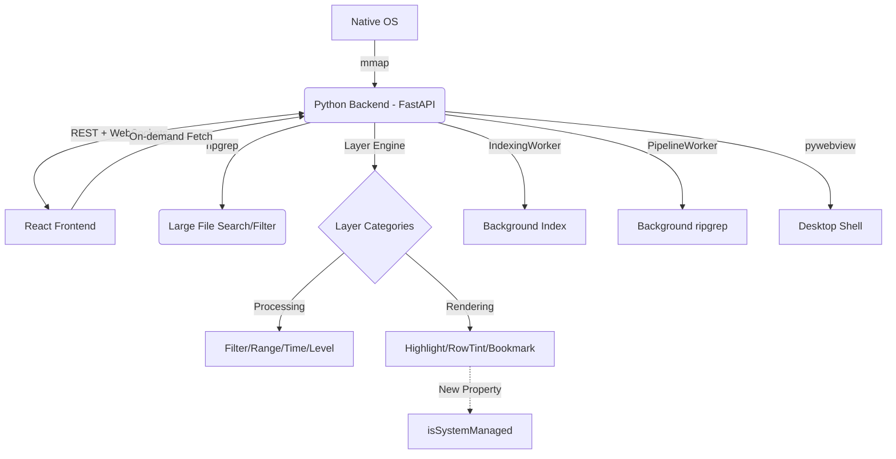

# LogLayer: Project Map

## 1. System Architecture

## 2. Module Topology

| Module | Location | Responsibility | Dependencies |
| :--- | :--- | :--- | :--- |
| **Backend Core** | `backend/bridge.py` | Orchestration, Signal handling, File indexing interface | `mmap`, `fastapi`, `websockets` |
| **Unified Logic** | `backend/loglayer/` | **Unified Layer Engine**, UI Schema generator, Plugin discovery, Built-in layers | `re`, `inspect`, `importlib` |
| **API Server** | `backend/main.py` | FastAPI app, REST/WS routes, **Bookmark API**, pywebview integration | `fastapi`, `uvicorn`, `pywebview` |
| **Bridge Client** | `frontend/src/bridge_client.ts` | Frontend API, Bookmark & Layer registry access | `fetch`, `WebSocket` |
| **Dynamic UI** | `frontend/src/components/DynamicUI/` | `InputMapper`, `DynamicForm`: Schema-driven configuration UI | `types.ts` |
| **Log Viewer** | `frontend/src/components/LogViewer.tsx` | High-performance HTML5 Canvas rendering, virtual scroll scaling | `bridge_client.ts` |
| **State Orchest.** | `frontend/src/App.tsx` | Global file state, UI layout, hook management | All Components |
| **Tests & Logs** | `tests/` | Unit tests, scale tests, and **test log samples** | `pytest`, `tests/logs/` |
| **Dev Tools** | `tools/` | Build and packaging scripts | `PyInstaller`, `npm` |

## 3. Core Feature List
- [x] **Large File Loading**: 1GB+ indexing via `mmap` offsets.
- [x] **Virtual Scrolling**: Viewport-only rendering for O(1) memory usage.
- [x] **Fast Search**: Native `ripgrep` integration.
- [x] **Native Interop**: Drag & drop (via browser), native file dialogs (via bridge).
- [x] **Platform-aware UI**: Backend-driven OS detection for path normalization and shortcuts.
- [x] **Layer Pipeline (Backend)**: Python-side filtering and highlighting via `sync_layers`.
- [x] **Browser Compatible**: Native dialog fallbacks (tkinter) for standalone browser mode.

## 4. Coupling Notes
- **Communication Contract**: `main.py` WebSocket messages must match `WebBridge` signal emitters in `bridge_client.ts`.
- **Virtualization Sync**: `LogViewer` viewport depends on `read_processed_lines` REST endpoint.
- **Layer Sync**: Frontend calls `sync_layers` (processing) or `sync_decorations` (rendering) based on layer category.
- **Platform Info**: `usePlatformInfo` depends on `/api/platform` REST endpoint for OS-specific logic.

## 5. Change Log

| Date | Category | Key Updates & Fixes |
| :--- | :--- | :--- |
| **2026-02-12** | **UX/Fix** | **Selection Rendering**: Fixed start position and character range for reversed (bottom-to-top) selections in LogViewer. |
| | **Search/Fix** | **Ctrl+F Auto-fill**: Canvas selections now automatically populate the search box via `onSelectedTextChange`. |
| | **Stability/Fix** | **Bookmark Previews**: Fixed the "Loading..." hang by triggering preview refreshes following toggle and comment updates. |
| **2026-02-11** | **Stability** | **Virtual Scroll Fix**: Unified `lineHeight` (20px) to resolve mapping drift in million-line files. |
| | **Build/Fix** | **Compilation Fix**: Resolved SVG sync errors in frontend and corrupted `__init__.py` in backend. |
| | **Feature** | **Dependency Management**: Added `requirements.txt` and `tools/install_deps.py` for easy setup. |
| **2026-02-09** | **Core/Hook** | **Platform Detection**: Added backend-driven `usePlatformInfo` hook; removed `navigator.platform` dependencies. |
| **2026-02-07** | **Feature** | **Bookmarks**: Persistent storage, comments support, and UI Popover. |
| | **Architecture** | Extracted `useSearchLogic`, `useBookmarkLogic`, `SearchMixin`. Optimized cache (O(N)). |
| | **Quality** | Fixed `mmap` safety, race conditions in F2, and session corruption. migrated to `pytest`. |
| | **Distribution** | New `DEPLOY.md`, Launcher scripts, and automated binary filtering in packaging. |
| **2026-02-05** | **UX/Core** | Unified "Open" entry, Breadcrumbs跳转, Path memory. Search mode toggle (Highlight/Filter). |
| | **Bug Fix** | Resolved FileTree sync, packaging paths, and special character search filtering. |
| **2026-02-04** | **Stability** | **CRITICAL**: Fixed signal corruption across sessions. Improved worker/zombie cleanup. |
| | **Refactor** | New `frontend/utils`, eliminated code duplication in `App.tsx` and `useFileManagement`. |
| **2026-02-02** | **Arch Refactor**| **FastAPI + pywebview migration**. Complete project reorganization. |
| | **Search/Fix** | "Nearest Next" logic (O(log N)). Fixed UI flickering and browser-mode dialog fallbacks. |

[... previous change logs archived ...]
