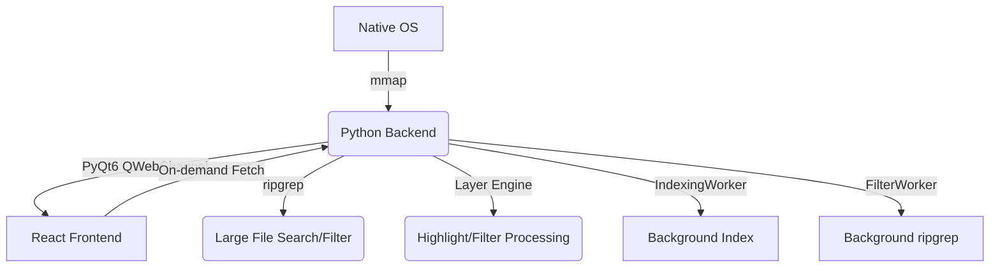

# LogLayer: Project Map

## 1. System Architecture

## 2. Module Topology

| Module | Location | Responsibility | Dependencies |
| :--- | :--- | :--- | :--- |
| **Backend Core** | `backend/bridge.py` | Orchestration, PyQt6 Bridge, File indexing interface | `PyQt6`, `loglayer` |
| **Unified Logic** | `backend/loglayer/` | **Unified Layer Engine**, UI Schema generator, Plugin discovery, Built-in layers | `re`, `inspect`, `importlib` |
| **GUI Shell** | `backend/main.py` | PyQt6 Window, WebView, Drag & Drop handler | `bridge.py`, `QWebEngineView` |
| **Bridge Client** | `frontend/src/bridge_client.ts` | Frontend API, Registry access, Sync protocols | `qwebchannel.js` |
| **Dynamic UI** | `frontend/src/components/DynamicUI/` | `InputMapper`, `DynamicForm`: Schema-driven configuration UI | `types.ts` |
| **Log Viewer** | `frontend/src/components/LogViewer.tsx` | Virtual list, scroll scaling, processed line rendering | `bridge_client.ts` |
| **State Orchest.** | `frontend/src/App.tsx` | Global file state, UI layout, hook management | All Components |

## 3. Core Feature List
- [x] **Large File Loading**: 1GB+ indexing via `mmap` offsets.
- [x] **Virtual Scrolling**: Viewport-only rendering for O(1) memory usage.
- [x] **Fast Search**: Native `ripgrep` integration.
- [x] **Native Interop**: Drag & drop, native file dialogs.
- [x] **Layer Pipeline (Backend)**: Python-side filtering and highlighting via `sync_layers`.

## 4. Coupling Notes
- **Communication Contract**: `bridge.py` signals (`fileLoaded`, `filterFinished`) must match `App.tsx` handlers.
- **Virtualization Sync**: `LogViewer` viewport depends on `readProcessedLines` from bridge.
- **Layer Sync**: Frontend calls `syncLayers` on layer config change; backend rebuilds filter/highlight patterns.

## 5. Change Log (2026-01-30)
- **Non-blocking parsing**: Migrated log indexing and ripgrep filtering to background `QThread` workers.
- **Multi-threaded indexing**: Accelerated line offset calculation using `ThreadPoolExecutor` over `mmap`.
- Migrated layer processing (FILTER, HIGHLIGHT) from frontend to Python backend.
- Added `sync_layers` and `read_processed_lines` slots to `FileBridge`.
- Introduced `_visible_indices` for filtered view mapping.
- Optimized line indexing with `mmap.find`.
- **Dual-Line Number System**: Repurposed the main gutter to show sequential text line numbers (1..N). Added a secondary, faint physical line number indicator (#N) that appears on hover or selection.
- **Sequential Pipeline**: Implemented a unified `PipelineWorker` that chains multiple `FILTER` and `LEVEL` layers using OS pipes. Search results are now derived from the final filtered output, ensuring perfect synchronization.
- **Update Optimization**: Optimized layer synchronization in `App.tsx` by using a functional hash. Selecting or collapsing layers no longer triggers expensive backend re-filtering.
- **Backend Stability**: Fixed `QThread` lifecycle issues by implementing a worker retirement system, preventing crashes and 'still running' warnings on file close or layer switch.
- **Bridge Reliability**: Enhanced `QWebChannel` monkey patch to handle missing callbacks robustly, clearing terminal TypeErrors during rapid navigation.
- **Async Logic Fix**: Eliminated GUI deadlocks by removing synchronous `.wait()` calls in the backend. Background workers are now stopped and disconnected asynchronously.
- **Search UI Polish**: Prevented accidental text selection on the match count indicator and navigation buttons in the search widget using `select-none`.
- **Unlimited Filtered Search**: Removed hard limits on search results. Now supports ultra-large match sets (e.g., 2M+ matches) by optimizing index intersections in `SearchWorker`.
- **Search-Filter Sync**: Updated frontend `useEffect` to re-trigger search when filter results (lineCount) change, ensuring consistent search results after layer updates.
- **Render Quality Fix**: Resolved text blurriness during scrolling by rounding transform offsets to integer pixels and enabling `translate3d` GPU acceleration.
- **Horizontal Scrolling support**: Fixed line truncation ('...') by removing width constraints and allowing horizontal expansion for long log lines.
- **Improved Virtual Scrolling**: Fixed line jittering during large file scrolling by correcting the `translateY` logic in `LogViewer.tsx` to handle scaled scroll offsets smoothly.
- **Scroll Optimization**: Added `will-change: transform` and optimized rendering for ultra-large files.

## 6. Change Log (2026-01-31)
- **StatusBar Sync Fix**: Resolved inconsistency between status bar counts and actual filtering results by removing the 2M line limit in `PipelineWorker`.
- **State Reliability**: Fixed a bug where `rawCount` was not refreshed on file reload, leading to stale total line counts.
- **UI Enhancement**: Improved `StatusBar` with search match counts, cleaner total line display, and a functional Ln (Line Number) indicator.
- **Dependency Optimization**: Switched `syncLayers` dependency from `lineCount` to `rawCount` in `App.tsx` to prevent redundant backend operations.
- **Test Consolidation**: Unified bug reproduction scripts into `tests/test_backend_core.py`, verifying pipeline scalability and mmap indexing integrity.
- **Documentation**: Generated comprehensive bilingual (EN/CN) README.md with project overview, features, and setup guide.
- **Improved File Opening**: Enhanced "File" and "Folder" buttons to use native OS dialogs via `select_files` and `select_folder`.
- **Recursive Directory Discovery**: Dropping a folder or selecting a folder now automatically scans and opens all log files within it recursively.
- **Multiple File Selection**: Native file dialog now supports selecting multiple files at once.
- **Interactive Placeholder**: The central "Drag a file here to open" area is now clickable and serves as a primary file selector.
- **Consistency**: Unified the logic for drag-and-drop and button-based file opening for both files and folders by moving the discovery logic to the backend.
- **File Loading Skeleton**: Added an elegant skeleton UI loading indicator that appears when switching between files. Features a shimmer animation effect and deterministically-generated skeleton lines to provide visual feedback during the loading delay.
- **Improved File Selection**: Fixed a bug where clicking an already active file in the sidebar caused redundant re-indexing and UI flickers. Added a check for the loaded state and current active state before triggering backend `open_file`.
- **Startup Optimization**: Removed a redundant `open_file` call from the `fileLoaded` signal handler in the frontend, preventing double-loading of CLI files.
- **Codebase Cleanup**: Removed legacy non-bridged code paths from frontend. Deleted unused `processors` directory and redundant test scripts.
- **Subprocess Management**: Enhanced `StatsWorker` in backend to properly track and terminate all piped `rg` processes on stop.
- **Empty File Support**: Fixed a bug where empty files were reported as having 1 line.
- **Architecture Simplification**: Removed redundant global caching in `App.tsx`, consolidating line fetching into `LogViewer`.
- **CLI Consistency**: Unified file ID generation logic across CLI, drag-and-drop, and native selection.
- **Startup Reliability (2026-01-31)**: Optimized the application initialization by replacing hardcoded `QTimer` delays for CLI file loading with a formal handshake protocol.
- **Loading Status Persistence**: Fixed a UI issue where the status bar would prematurely show "Ready" while files were still being opened or indexed.
- **Visual Identity**: Generated integrated premium icon and Windows taskbar support.
- **Codebase Cleanup & Optimization (2026-01-31)**:
    - **Highlight Layer Fixes**:
        - **Stacking Order**: Corrected rendering order so top UI layers properly overlay bottom layers (reverse iteration in `bridge.py`).
        - **Stats Restoration**: Fixed a regression where match counts were missing due to incorrect data type passing (Dict vs Object) to `StatsWorker`.
        - **Performance Optimization**: Parallelized `StatsWorker` using `ThreadPoolExecutor` to calculate match counts for multiple layers concurrently, significantly reducing update latency for complex configurations.
    - **Backend**: DRYed pipeline and filter logic in `bridge.py`. Unified recursive file discovery. Improved worker retirement system to be fully asynchronous.
    - **Frontend**: Refactored `App.tsx` by extracting complex loading UI into `LoadingOverlays.tsx`. Unified multi-channel file adding logic into a single `addNewFiles` helper. Simplified bridge initialization in `bridge_client.ts`.
    - **Architecture**: Solidified the session lifecycle management, ensuring workers are properly retired when files are closed or replaced.
- **Workspace Config Persistence**: Added automatic layer configuration persistence. Layer configurations are now saved to `.loglayer/config.json` in the workspace folder and auto-loaded when reopening the same folder. Implemented via `useWorkspaceConfig` hook with 1-second debounced auto-save.
- **Standalone Packaging**: Implemented cross-platform one-click offline packaging workflow. Added `package.bat` and `package_exe.bat` for building self-contained Windows distributions. Output includes `LogLayer_Standalone` (Frozen EXE) and bundles `rg` binaries for both platforms. Fixed issue where subprocesses (e.g. `ripgrep`) would pop up console windows by using `CREATE_NO_WINDOW` flags on Windows.
- **Qt Compatibility Layer**: Introduced `qt_compat.py` to provide a unified API for PyQt6, PySide6, PyQt5, and PySide2. This allows the backend to run on systems with different Qt bindings installed.
## 7. Change Log (2026-02-01)
- **Unified Layer Architecture**: Fully migrated all processing logic (Filter, Highlight, Level, etc.) to a unified Python component system.
- **Python-Driven UI**: Implemented `loglayer.ui` for defining frontend schemas in Python. Frontend now dynamically renders configuration UIs using `InputMapper` and `DynamicForm`.
- **Plugin System**: Introduced a runtime plugin discovery mechanism that allows adding custom Python layers without modifying frontend code.
- **Backend Registry**: Centralized layer management in `LayerRegistry`, providing metadata and UI schemas to the frontend via bridge.
- **Staged Pipeline Implementation**: Added a multi-stage execution model in `PipelineWorker` that chains native `ripgrep` filters with complex Python logic while preserving physical line numbers.
- **Search Navigation Optimization**: Optimized search result navigation for ultra-large files using on-demand rank-based index fetching.
- **UI Unification**: Replaced hardcoded configuration components with the new `DynamicUI` engine in `LayersPanel.tsx` and updated `Add Layer` menu in `UnifiedPanel.tsx` to be registry-driven.
- **Enhanced Icon System**: Implemented a dynamic, registry-driven icon system for layers.
- **Robust Drag & Drop**: Rewrote `LayersPanel.tsx` drag-and-drop logic with global fallback tracking and hit-test optimization.
- **Qt/Electron Compatibility**: Fixed the "forbidden" cursor issue in the PyQt6 environment by preventing default drag behavior on the root application window.
- **Intelligent Reordering**: Improved `useLayerManagement.ts` with circular drop prevention and precise index calculation for complex layer hierarchies.
- **UI Interaction Polish**: Added drag handles, improved hover effects for sorting, and fixed accidental text selection during drag operations.
- **Layer Sync Persistence**: Implemented backend `sync_layers` and refined the frontend call to ensure layer order and hierarchy are persisted with the workspace configuration.
- **Codebase Cleanup**: Removed obsolete `layer-configs` directory and unused `ExplorerPanel.tsx`. Organized development tools into `frontend/dev-tools`.
- **Component Refactoring**: Localized `ColorPicker` implementation to `DynamicUI`, eliminating dependency on legacy code.
- **Type Safety**: Fixed signal signature mismatch in `useBridge` for `pipelineFinished` to ensure correct type handling.
- **UI Stability & Polish**:
    - **Visual Glitch Fix**: Resolved the "UI Jumping" and "Black Line" issue during loading and layer toggling by using absolute positioning for `LoadingOverlays` and the progress bar.
    - **Default Collapsed State**: Enhanced `UnifiedPanel` and `useWorkspaceConfig` to ensure all file lists and restored layers start in a collapsed state by default, reducing initial cognitive load.
    - **Layout Optimization**: Removed excessive bottom padding in `LayersPanel` to eliminate awkward blank spaces between file sections.
