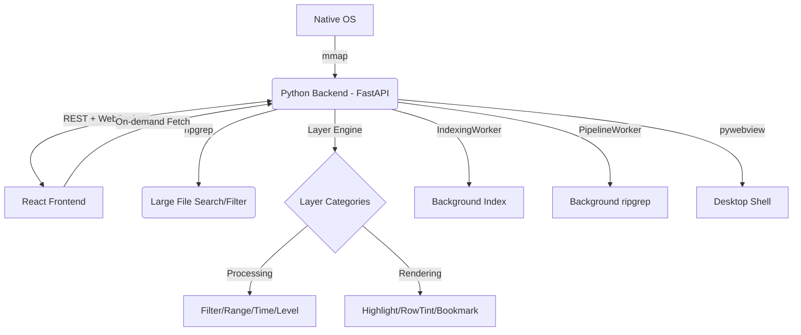

# LogLayer: Project Map

## 1. System Architecture

## 2. Module Topology

| Module | Location | Responsibility | Dependencies |
| :--- | :--- | :--- | :--- |
| **Backend Core** | `backend/bridge.py` | Orchestration, Signal handling, File indexing interface | `mmap`, `fastapi`, `websockets` |
| **Unified Logic** | `backend/loglayer/` | **Unified Layer Engine**, UI Schema generator, Plugin discovery, Built-in layers | `re`, `inspect`, `importlib` |
| **API Server** | `backend/main.py` | FastAPI app, REST/WS routes, **pywebview** integration | `fastapi`, `uvicorn`, `pywebview` |
| **Bridge Client** | `frontend/src/bridge_client.ts` | Frontend API, Registry access, REST + WS protocols | `fetch`, `WebSocket` |
| **Dynamic UI** | `frontend/src/components/DynamicUI/` | `InputMapper`, `DynamicForm`: Schema-driven configuration UI | `types.ts` |
| **Log Viewer** | `frontend/src/components/LogViewer.tsx` | Virtual list, scroll scaling, processed line rendering | `bridge_client.ts` |
| **State Orchest.** | `frontend/src/App.tsx` | Global file state, UI layout, hook management | All Components |
| **Tests & Logs** | `tests/` | Unit tests, scale tests, and **test log samples** | `pytest`, `tests/logs/` |
| **Dev Tools** | `tools/` | Build and packaging scripts | `PyInstaller`, `npm` |

## 3. Core Feature List
- [x] **Large File Loading**: 1GB+ indexing via `mmap` offsets.
- [x] **Virtual Scrolling**: Viewport-only rendering for O(1) memory usage.
- [x] **Fast Search**: Native `ripgrep` integration.
- [x] **Native Interop**: Drag & drop (via browser), native file dialogs (via bridge).
- [x] **Layer Pipeline (Backend)**: Python-side filtering and highlighting via `sync_layers`.
- [x] **Browser Compatible**: Native dialog fallbacks (tkinter) for standalone browser mode.

## 4. Coupling Notes
- **Communication Contract**: `main.py` WebSocket messages must match `WebBridge` signal emitters in `bridge_client.ts`.
- **Virtualization Sync**: `LogViewer` viewport depends on `read_processed_lines` REST endpoint.
- **Layer Sync**: Frontend calls `sync_layers` (processing) or `sync_decorations` (rendering) based on layer category.

## 5. Change Log (2026-02-05)
- **Layer Decoupling Architecture**: Major refactoring to separate data processing from rendering enhancement layers.
    - **New Base Classes**: `DataProcessingLayer`, `NativeProcessingLayer`, `RenderingLayer` in `loglayer/core.py`.
    - **Layer Categories**: `processing` (Filter, Level, Range, Time, Replace) vs `rendering` (Highlight, RowTint, Bookmark).
    - **API Split**: Deprecated `sync_all`, replaced with `sync_layers` (full pipeline rerun) and `sync_decorations` (cache-only refresh).
    - **Two-Zone UI**: `LayersPanel.tsx` now groups layers into "处理层" (Processing) and "渲染层" (Rendering) zones.
    - **New Layers**: Added `RowTintLayer` (row background coloring) and `BookmarkLayer` (line marking).
- **Search Enhancements**:
    - **Mode Toggle**: Find widget now supports "高亮" (highlight-only) and "过滤" (filter) mode switching.
    - **Auto-Navigate**: Search results auto-jump to nearest match on completion (VS Code parity).

## 6. Change Log (2026-02-04)
- **Code Audit & Refactoring**: Deep code review and optimization.
    - **Test Framework Migration**: Rewrote `test_backend_core.py` and `test_unified_pipeline.py` to use `threading.Event` instead of deprecated PyQt6.
    - **Frontend Utils Library**: Created `frontend/src/utils/index.ts` with `basename()`, `removeFromSet()`, `addToSet()`, `formatFileSize()`, `generateId()`, `debounce()`.
    - **Duplicate Code Elimination**: Replaced 5+ instances of repeated Set operations and path parsing in `App.tsx` and `useFileManagement.ts`.
    - **Process Management Fix**: Added `_cleanup_processes()` method in `PipelineWorker` with proper `kill()` fallback for zombie processes.
    - **Zombie Worker Leak Fix**: Added periodic cleanup counter in `FileBridge._cleanup_zombie()` to prevent memory leaks from accumulated workers.
    - **Dead Code Removal**: Removed unused `isLayerProcessing` state from `useSearch.ts`.
- **Bug Fix**: Resolved "Filter Layer Empty View" issue.
    - **Root Cause**: An optimization in `PipelineWorker` was injecting `-o ^` (only match start of line) to reduce IPC overhead. This caused `ripgrep` in Fixed String mode (`-F`) to treat `^` as a literal pattern, failing to match anything.
    - **Fix**: Removed the faulty optimization. `PipelineWorker` now correctly receives full line content from native layers, ensuring compatibility with all regex/fixed-string modes.
    - **Verification**: Added `tests/reproduce_filter_bug.py`.
- **CRITICAL BACKEND FIX**: Fixed severe session corruption bug causing file content merging.
    - **Root Cause**: Custom `Signal` class in `bridge.py` defined signals as class attributes, causing all Worker threads (Indexing, Pipeline, Stats) to share the same signal instances.
    - **Symptom**: Opening File 2 triggers File 2's indexing finished signal, which due to sharing, executes File 1's callback, overwriting File 1's `line_offsets` with File 2's offsets.
    - **Fix**: Moved Signal instantiation to `__init__` in all Worker classes (`IndexingWorker`, `PipelineWorker`, `StatsWorker`) to ensure instance isolation.
- **Frontend Tweak**: Added `whitespace-pre` and `min-w-0` to `LogViewer` CSS to ensure robust text display preventing unwanted wrapping.

## 7. Change Log (2026-02-03)
- **Bug Fix**: Repaired Search-induced "Empty View" issue. 
    - Decoupled Global Search from the `PipelineWorker` visibility chain.
    - Search now behaves as a non-destructive highlight by default.
    - Independent search match calculation ensures high performance for large files.
- **Search Optimization**: Implemented "Nearest Next" navigation logic.
    - Search navigation now jumps to the match closest to the current cursor/selected line.
    - Added `get_nearest_search_rank` backend API using binary search (bisect) for O(log N) efficiency.
- **UI/UX Stability**:
    - Fixed search highlight lingering after closing find widget.
    - Resolved input flickering by centralizing search state in `App.tsx`.
    - Added "Auto-jump to nearest" behavior immediately after a new search is performed.
    - **Browser Mode Fix**:
    - Implemented `tkinter` fallback for file/folder dialogs when running with `--no-ui`.
    - Resolved port 3000 collision issues and clarified dev server requirement.
    - Cleaned up obsolete `qtwebchannel.js` from `index.html`.

## 8. Change Log (2026-02-02) 
- **Architecture Refactor**: Migrated from PyQt to FastAPI + pywebview.
- **Project Structure Reorganization**: 
    - Consolidated all `.log` files into `tests/logs/`.
    - Moved test scripts to `tests/`.
    - Moved packaging scripts to `tools/`.
    - Cleaned up root directory by removing unused metadata and ignoring test logs.

[... previous change logs ...]
