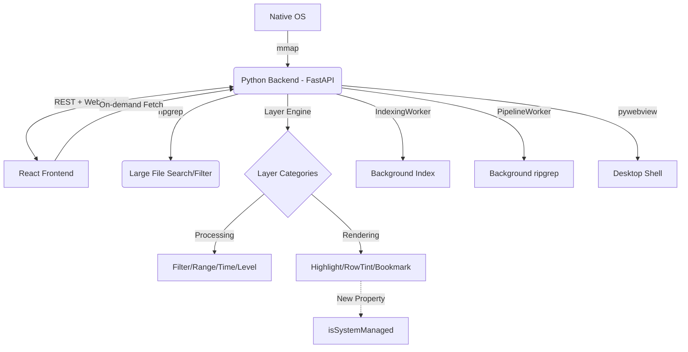

# LogLayer: Project Map

## 1. System Architecture

## 2. Module Topology

| Module | Location | Responsibility | Dependencies |
| :--- | :--- | :--- | :--- |
| **Backend Core** | `backend/bridge.py` | Orchestration, Signal handling, File indexing interface | `mmap`, `fastapi`, `websockets` |
| **Unified Logic** | `backend/loglayer/` | **Unified Layer Engine**, UI Schema generator, Plugin discovery, Built-in layers | `re`, `inspect`, `importlib` |
| **API Server** | `backend/main.py` | FastAPI app, REST/WS routes, **Bookmark API**, pywebview integration | `fastapi`, `uvicorn`, `pywebview` |
| **Bridge Client** | `frontend/src/bridge_client.ts` | Frontend API, Bookmark & Layer registry access | `fetch`, `WebSocket` |
| **Dynamic UI** | `frontend/src/components/DynamicUI/` | `InputMapper`, `DynamicForm`: Schema-driven configuration UI | `types.ts` |
| **Log Viewer** | `frontend/src/components/LogViewer.tsx` | Virtual list, scroll scaling, processed line rendering | `bridge_client.ts` |
| **State Orchest.** | `frontend/src/App.tsx` | Global file state, UI layout, hook management | All Components |
| **Tests & Logs** | `tests/` | Unit tests, scale tests, and **test log samples** | `pytest`, `tests/logs/` |
| **Dev Tools** | `tools/` | Build and packaging scripts | `PyInstaller`, `npm` |

## 3. Core Feature List
- [x] **Large File Loading**: 1GB+ indexing via `mmap` offsets.
- [x] **Virtual Scrolling**: Viewport-only rendering for O(1) memory usage.
- [x] **Fast Search**: Native `ripgrep` integration.
- [x] **Native Interop**: Drag & drop (via browser), native file dialogs (via bridge).
- [x] **Layer Pipeline (Backend)**: Python-side filtering and highlighting via `sync_layers`.
- [x] **Browser Compatible**: Native dialog fallbacks (tkinter) for standalone browser mode.

## 4. Coupling Notes
- **Communication Contract**: `main.py` WebSocket messages must match `WebBridge` signal emitters in `bridge_client.ts`.
- **Virtualization Sync**: `LogViewer` viewport depends on `read_processed_lines` REST endpoint.
- **Layer Sync**: Frontend calls `sync_layers` (processing) or `sync_decorations` (rendering) based on layer category.

## 5. Change Log (2026-02-07)
- **Bug Fix Sprint**: 针对代码质量分析发现的问题进行了集中修复。
    - **Type Safety**: 修复 `LogViewer` 右键菜单 `lineIndex` 类型缺失问题。
    - **Hook Dependencies**: 修复 `useSearch` Hook 中 `clearSearch` 缺少依赖的潜在 Bug。
    - **Race Condition**: 优化书签导航 (`F2`) 逻辑，使用 `useRef` 管理超时，防止快速按键导致的竞态冲突。
    - **Stability**: 后端增加 `mmap` 关闭状态检查，防止读取已关闭文件导致崩溃。
    - **Boundary Case**: 修复当所有行被过滤时 (`visible_indices` 为空) 书签导航可能越界的问题。
- **Code Quality**:
    - **Refactoring**: 提取 `useDrag` Hook，消除 `UnifiedPanel.tsx` 中的重复拖拽逻辑。
    - **Maintainability**: 将 `PipelineWorker` 进程清理超时提取为 `PROCESS_CLEANUP_TIMEOUT` 常量。
- **Documentation**: 更新 `DESIGN.md` 以反映从 PyQt6 到 FastAPI 的架构迁移。
- **Performance & Architecture Optimization (Phase 5)**:
    - **Frontend Refactoring**: 
        - 提取 `useSearchLogic` 和 `useBookmarkLogic` Hooks，将 `App.tsx` 中的重度业务逻辑解耦。
        - 优化 `LogViewer` 行缓存策略，采用基于距离的淘汰算法，将淘汰效率从 `O(N log N)` 提升至 `O(N)`。
    - **Backend Refactoring**: 
        - 提取 `SearchMixin` (`backend/search_mixin.py`)，将搜索、书签和索引转换逻辑从主 `FileBridge` 类中剥离。
        - 增强 `main.py` 异常捕获和端口冲突提示，默认端口保持 12345 但支持灵活调整。
    - **Bug Fix**: 修复了 `useDrag` Hook 的累加计算错误以及由此导致的面板抖动问题。
- **Phase 8: Distribution & Deployment (2026-02-07)**:
    - **Packaging Refinement**: 增强 `package_offline.py` 脚本，支持针对当前 OS 的二进制文件自动过滤。
    - **Deployment Guide**: 新增 `DEPLOY.md`，提供了跨平台的详细部署与运行说明。
    - **Launcher Scripts**: 完善了 Windows/Linux 启动脚本，支持权限自动设置。
- **Plugin API Expansion (Phase 7)**:
- **Automated Testing Enhancement (Phase 6)**:
    - **Testing Framework**: 引入 `pytest` 替换零散测试脚本，提供更标准的基础设施 (`conftest.py`)。
    - **Unit Testing**: 为 `SearchMixin` 增加了高覆盖率的单元测试，涵盖索引转换与搜索 rank 计算逻辑。
    - **Integration Testing**: 基于 `FastAPI TestClient` 实现了接口自动化测试。
    - **Automation Tool**: 新增 `tools/run_tests.py` 一键执行全量测试套件。

## 6. Change Log (2026-02-05)
- **Unified Opening Flow**: 整合“打开文件”与“打开项目”为统一的“浏览并打开 (Open)”入口。
    - **Logic**: 基于 `RemotePathPicker` 的 `both` 模式，自动识别文件（直接打开）或文件夹（设为工作区）。
    - **UI**: 侧边栏 Explorer 和欢迎界面提供一致的单入口体验。
- **Interactive Navigation & Path Memory**:
    - **Breadcrumbs**: 路径选择器面包屑支持点击跳转。
    - **Refresh**: 支持 `Ctrl+R` 刷新当前目录。
    - **Path Memory**: 使用 `localStorage` 记忆上一次打开的路径，提升连续操作效率。
- **Core Bug Fixes**:
    - **FileTree Sync**: 修复了切换工作区后文件浏览器内容不更新的 BUG。通过为根 `TreeNode` 增加 `key={path}` 强制销毁旧状态。
    - **Packaging Pipeline**: 优化并解决了多个打包路径和权限问题。
    - **Special Characters Filter**: 修复了以连字符开头的搜索查询导致结果为空的问题（强制使用 `-e` 标志）。
- **Search Enhancements**:
    - **Mode Toggle**: Find widget now supports "高亮" (highlight-only) and "过滤" (filter) mode switching.
    - **Auto-Navigate**: Search results auto-jump to nearest match on completion (VS Code parity).
- **Bookmark & System Managed Layers**:
    - **Architecture**: 引入了 `isSystemManaged` 属性，允许特定功能（如书签）复用图层架构同时从用户主列表隐藏。
    - **Interactions**: 支持点击行号区域 (Gutter) 切换书签，行号旁显示琥珀色圆点。
    - **Backend API**: 新增 `toggle_bookmark`、`get_bookmarks`、`get_nearest_bookmark_index` (F2 导航支持)。
    - **Debug Toggle**: 在“已打开”面板增加“系统/用户”切换开关，用于强制显示隐藏的系统图层。

## 6. Change Log (2026-02-04)
- **Code Audit & Refactoring**: Deep code review and optimization.
    - **Test Framework Migration**: Rewrote `test_backend_core.py` and `test_unified_pipeline.py` to use `threading.Event` instead of deprecated PyQt6.
    - **Frontend Utils Library**: Created `frontend/src/utils/index.ts` with `basename()`, `removeFromSet()`, `addToSet()`, `formatFileSize()`, `generateId()`, `debounce()`.
    - **Duplicate Code Elimination**: Replaced 5+ instances of repeated Set operations and path parsing in `App.tsx` and `useFileManagement.ts`.
    - **Process Management Fix**: Added `_cleanup_processes()` method in `PipelineWorker` with proper `kill()` fallback for zombie processes.
    - **Zombie Worker Leak Fix**: Added periodic cleanup counter in `FileBridge._cleanup_zombie()` to prevent memory leaks from accumulated workers.
    - **Dead Code Removal**: Removed unused `isLayerProcessing` state from `useSearch.ts`.
- **Bug Fix**: Resolved "Filter Layer Empty View" issue.
    - **Root Cause**: An optimization in `PipelineWorker` was injecting `-o ^` (only match start of line) to reduce IPC overhead. This caused `ripgrep` in Fixed String mode (`-F`) to treat `^` as a literal pattern, failing to match anything.
    - **Fix**: Removed the faulty optimization. `PipelineWorker` now correctly receives full line content from native layers, ensuring compatibility with all regex/fixed-string modes.
    - **Verification**: Added `tests/reproduce_filter_bug.py`.
- **CRITICAL BACKEND FIX**: Fixed severe session corruption bug causing file content merging.
    - **Root Cause**: Custom `Signal` class in `bridge.py` defined signals as class attributes, causing all Worker threads (Indexing, Pipeline, Stats) to share the same signal instances.
    - **Symptom**: Opening File 2 triggers File 2's indexing finished signal, which due to sharing, executes File 1's callback, overwriting File 1's `line_offsets` with File 2's offsets.
    - **Fix**: Moved Signal instantiation to `__init__` in all Worker classes (`IndexingWorker`, `PipelineWorker`, `StatsWorker`) to ensure instance isolation.
- **Frontend Tweak**: Added `whitespace-pre` and `min-w-0` to `LogViewer` CSS to ensure robust text display preventing unwanted wrapping.

## 7. Change Log (2026-02-03)
- **Bug Fix**: Repaired Search-induced "Empty View" issue. 
    - Decoupled Global Search from the `PipelineWorker` visibility chain.
    - Search now behaves as a non-destructive highlight by default.
    - Independent search match calculation ensures high performance for large files.
- **Search Optimization**: Implemented "Nearest Next" navigation logic.
    - Search navigation now jumps to the match closest to the current cursor/selected line.
    - Added `get_nearest_search_rank` backend API using binary search (bisect) for O(log N) efficiency.
- **UI/UX Stability**:
    - Fixed search highlight lingering after closing find widget.
    - Resolved input flickering by centralizing search state in `App.tsx`.
    - Added "Auto-jump to nearest" behavior immediately after a new search is performed.
    - **Browser Mode Fix**:
    - Implemented `tkinter` fallback for file/folder dialogs when running with `--no-ui`.
    - Resolved port 3000 collision issues and clarified dev server requirement.
    - Cleaned up obsolete `qtwebchannel.js` from `index.html`.

## 8. Change Log (2026-02-02) 
- **Architecture Refactor**: Migrated from PyQt to FastAPI + pywebview.
- **Project Structure Reorganization**: 
    - Consolidated all `.log` files into `tests/logs/`.
    - Moved test scripts to `tests/`.
    - Moved packaging scripts to `tools/`.
    - Cleaned up root directory by removing unused metadata and ignoring test logs.

[... previous change logs ...]
