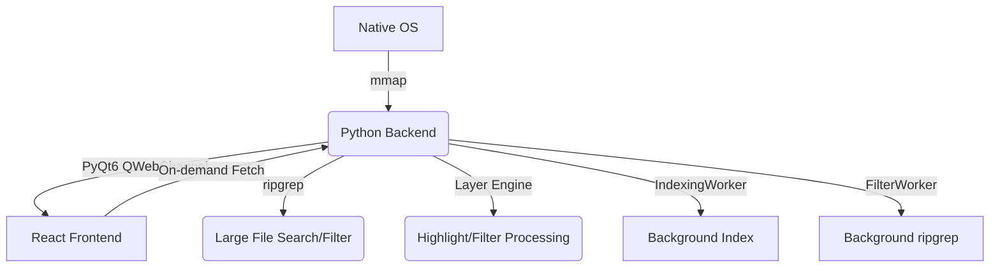

# LogLayer: Project Map

## 1. System Architecture

## 2. Module Topology

| Module | Location | Responsibility | Dependencies |
| :--- | :--- | :--- | :--- |
| **Backend Core** | `backend/bridge.py` | Line indexing, mmap access, **Layer Engine** (filter/highlight), ripgrep interface | `mmap`, `ripgrep`, `re` |
| **GUI Shell** | `backend/main.py` | PyQt6 Window, WebView, Drag & Drop handler | `bridge.py`, `QWebEngineView` |
| **Bridge Client** | `frontend/src/bridge_client.ts` | Frontend API, `syncLayers`, `readProcessedLines` | `qwebchannel.js` |
| **Log Viewer** | `frontend/src/components/LogViewer.tsx` | Virtual list, scroll scaling, processed line rendering | `bridge_client.ts` |
| **State Orchest.** | `frontend/src/App.tsx` | Global file state, layer sync to backend, UI layout | All Components |

## 3. Core Feature List
- [x] **Large File Loading**: 1GB+ indexing via `mmap` offsets.
- [x] **Virtual Scrolling**: Viewport-only rendering for O(1) memory usage.
- [x] **Fast Search**: Native `ripgrep` integration.
- [x] **Native Interop**: Drag & drop, native file dialogs.
- [x] **Layer Pipeline (Backend)**: Python-side filtering and highlighting via `sync_layers`.

## 4. Coupling Notes
- **Communication Contract**: `bridge.py` signals (`fileLoaded`, `filterFinished`) must match `App.tsx` handlers.
- **Virtualization Sync**: `LogViewer` viewport depends on `readProcessedLines` from bridge.
- **Layer Sync**: Frontend calls `syncLayers` on layer config change; backend rebuilds filter/highlight patterns.

## 5. Change Log (2026-01-30)
- **Non-blocking parsing**: Migrated log indexing and ripgrep filtering to background `QThread` workers.
- **Multi-threaded indexing**: Accelerated line offset calculation using `ThreadPoolExecutor` over `mmap`.
- Migrated layer processing (FILTER, HIGHLIGHT) from frontend to Python backend.
- Added `sync_layers` and `read_processed_lines` slots to `FileBridge`.
- Introduced `_visible_indices` for filtered view mapping.
- Optimized line indexing with `mmap.find`.
- **Dual-Line Number System**: Repurposed the main gutter to show sequential text line numbers (1..N). Added a secondary, faint physical line number indicator (#N) that appears on hover or selection.
- **Sequential Pipeline**: Implemented a unified `PipelineWorker` that chains multiple `FILTER` and `LEVEL` layers using OS pipes. Search results are now derived from the final filtered output, ensuring perfect synchronization.
- **Update Optimization**: Optimized layer synchronization in `App.tsx` by using a functional hash. Selecting or collapsing layers no longer triggers expensive backend re-filtering.
- **Backend Stability**: Fixed `QThread` lifecycle issues by implementing a worker retirement system, preventing crashes and 'still running' warnings on file close or layer switch.
- **Bridge Reliability**: Enhanced `QWebChannel` monkey patch to handle missing callbacks robustly, clearing terminal TypeErrors during rapid navigation.
- **Async Logic Fix**: Eliminated GUI deadlocks by removing synchronous `.wait()` calls in the backend. Background workers are now stopped and disconnected asynchronously.
- **Search UI Polish**: Prevented accidental text selection on the match count indicator and navigation buttons in the search widget using `select-none`.
- **Unlimited Filtered Search**: Removed hard limits on search results. Now supports ultra-large match sets (e.g., 2M+ matches) by optimizing index intersections in `SearchWorker`.
- **Search-Filter Sync**: Updated frontend `useEffect` to re-trigger search when filter results (lineCount) change, ensuring consistent search results after layer updates.
- **Render Quality Fix**: Resolved text blurriness during scrolling by rounding transform offsets to integer pixels and enabling `translate3d` GPU acceleration.
- **Horizontal Scrolling support**: Fixed line truncation ('...') by removing width constraints and allowing horizontal expansion for long log lines.
- **Improved Virtual Scrolling**: Fixed line jittering during large file scrolling by correcting the `translateY` logic in `LogViewer.tsx` to handle scaled scroll offsets smoothly.
- **Scroll Optimization**: Added `will-change: transform` and optimized rendering for ultra-large files.

## 6. Change Log (2026-01-31)
- **StatusBar Sync Fix**: Resolved inconsistency between status bar counts and actual filtering results by removing the 2M line limit in `PipelineWorker`.
- **State Reliability**: Fixed a bug where `rawCount` was not refreshed on file reload, leading to stale total line counts.
- **UI Enhancement**: Improved `StatusBar` with search match counts, cleaner total line display, and a functional Ln (Line Number) indicator.
- **Dependency Optimization**: Switched `syncLayers` dependency from `lineCount` to `rawCount` in `App.tsx` to prevent redundant backend operations.
- **Test Consolidation**: Unified bug reproduction scripts into `tests/test_backend_core.py`, verifying pipeline scalability and mmap indexing integrity.
- **Documentation**: Generated comprehensive bilingual (EN/CN) README.md with project overview, features, and setup guide.
- **Improved File Opening**: Enhanced "File" and "Folder" buttons to use native OS dialogs via `select_files` and `select_folder`.
- **Recursive Directory Discovery**: Dropping a folder or selecting a folder now automatically scans and opens all log files within it recursively.
- **Multiple File Selection**: Native file dialog now supports selecting multiple files at once.
- **Interactive Placeholder**: The central "Drag a file here to open" area is now clickable and serves as a primary file selector.
- **Consistency**: Unified the logic for drag-and-drop and button-based file opening for both files and folders by moving the discovery logic to the backend.
- **File Loading Skeleton**: Added an elegant skeleton UI loading indicator that appears when switching between files. Features a shimmer animation effect and deterministically-generated skeleton lines to provide visual feedback during the loading delay.
