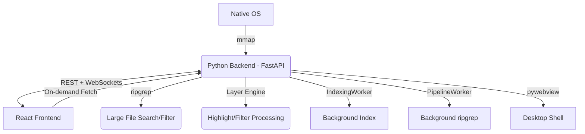

# LogLayer: Project Map

## 1. System Architecture

## 2. Module Topology

| Module | Location | Responsibility | Dependencies |
| :--- | :--- | :--- | :--- |
| **Backend Core** | `backend/bridge.py` | Orchestration, Signal handling, File indexing interface | `mmap`, `fastapi`, `websockets` |
| **Unified Logic** | `backend/loglayer/` | **Unified Layer Engine**, UI Schema generator, Plugin discovery, Built-in layers | `re`, `inspect`, `importlib` |
| **API Server** | `backend/main.py` | FastAPI app, REST/WS routes, **pywebview** integration | `fastapi`, `uvicorn`, `pywebview` |
| **Bridge Client** | `frontend/src/bridge_client.ts` | Frontend API, Registry access, REST + WS protocols | `fetch`, `WebSocket` |
| **Dynamic UI** | `frontend/src/components/DynamicUI/` | `InputMapper`, `DynamicForm`: Schema-driven configuration UI | `types.ts` |
| **Log Viewer** | `frontend/src/components/LogViewer.tsx` | Virtual list, scroll scaling, processed line rendering | `bridge_client.ts` |
| **State Orchest.** | `frontend/src/App.tsx` | Global file state, UI layout, hook management | All Components |

## 3. Core Feature List
- [x] **Large File Loading**: 1GB+ indexing via `mmap` offsets.
- [x] **Virtual Scrolling**: Viewport-only rendering for O(1) memory usage.
- [x] **Fast Search**: Native `ripgrep` integration.
- [x] **Native Interop**: Drag & drop (via browser), native file dialogs (via bridge).
- [x] **Layer Pipeline (Backend)**: Python-side filtering and highlighting via `sync_layers`.
- [x] **Browser Compatible**: Architecture ready for web-based deployment.

## 4. Coupling Notes
- **Communication Contract**: `main.py` WebSocket messages must match `WebBridge` signal emitters in `bridge_client.ts`.
- **Virtualization Sync**: `LogViewer` viewport depends on `read_processed_lines` REST endpoint.
- **Layer Sync**: Frontend calls `sync_all` REST endpoint on layer config change.

## 5. Change Log (2026-02-02) - PyQt to pywebview Refactor
- **Architecture Shift**: Decoupled the backend from PyQt. Replaced `QWebChannel` with a dual-protocol `REST` (commands) + `WebSockets` (signals) model.
- **Backend Refactoring**: 
    - Moved from `PyQt6` to `FastAPI` and `uvicorn`.
    - Replaced `QThread` with a standard Python `threading.Thread` wrapper (`CustomThread`).
    - Implemented a pure Python `Signal` class for event broadcasting.
    - Updated `bridge.py` to be a plain Python class, using `pywebview`'s `create_file_dialog` for native OS interaction.
- **Frontend Refactoring**:
    - Rewrote `bridge_client.ts` to use `fetch` for all API calls and a persistent `WebSocket` for signal reception.
    - Implemented a client-side `Signal` emulator to maintain compatibility with existing `connect()` patterns.
    - Removed `qwebchannel.js` dependency.
- **Desktop Shell**: Migrated the GUI container from `PyQt6.QWebEngineView` to `pywebview`.
- **Dependency Optimization**: Removed `qt_compat.py` and all `PyQt6` related code, significantly reducing the application's footprint and complexity.

[... previous change logs ...]
