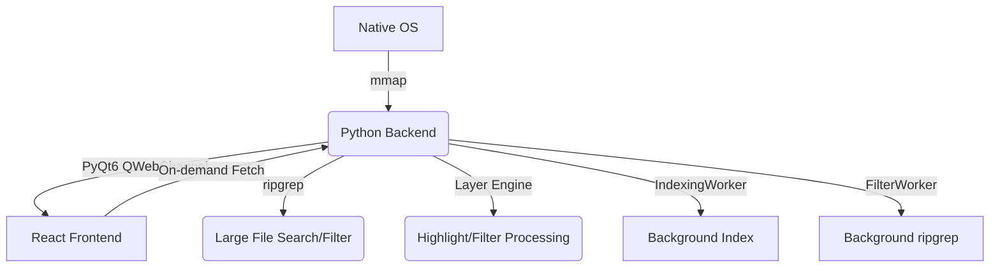

# LogLayer Pro: Project Map

## 1. System Architecture

## 2. Module Topology

| Module | Location | Responsibility | Dependencies |
| :--- | :--- | :--- | :--- |
| **Backend Core** | `backend/bridge.py` | Line indexing, mmap access, **Layer Engine** (filter/highlight), ripgrep interface | `mmap`, `ripgrep`, `re` |
| **GUI Shell** | `backend/main.py` | PyQt6 Window, WebView, Drag & Drop handler | `bridge.py`, `QWebEngineView` |
| **Bridge Client** | `frontend/src/bridge_client.ts` | Frontend API, `syncLayers`, `readProcessedLines` | `qwebchannel.js` |
| **Log Viewer** | `frontend/src/components/LogViewer.tsx` | Virtual list, scroll scaling, processed line rendering | `bridge_client.ts` |
| **State Orchest.** | `frontend/src/App.tsx` | Global file state, layer sync to backend, UI layout | All Components |

## 3. Core Feature List
- [x] **Large File Loading**: 1GB+ indexing via `mmap` offsets.
- [x] **Virtual Scrolling**: Viewport-only rendering for O(1) memory usage.
- [x] **Fast Search**: Native `ripgrep` integration.
- [x] **Native Interop**: Drag & drop, native file dialogs.
- [x] **Layer Pipeline (Backend)**: Python-side filtering and highlighting via `sync_layers`.

## 4. Coupling Notes
- **Communication Contract**: `bridge.py` signals (`fileLoaded`, `filterFinished`) must match `App.tsx` handlers.
- **Virtualization Sync**: `LogViewer` viewport depends on `readProcessedLines` from bridge.
- **Layer Sync**: Frontend calls `syncLayers` on layer config change; backend rebuilds filter/highlight patterns.

## 5. Change Log (2026-01-30)
- **Non-blocking parsing**: Migrated log indexing and ripgrep filtering to background `QThread` workers.
- **Multi-threaded indexing**: Accelerated line offset calculation using `ThreadPoolExecutor` over `mmap`.
- Migrated layer processing (FILTER, HIGHLIGHT) from frontend to Python backend.
- Added `sync_layers` and `read_processed_lines` slots to `FileBridge`.
- Introduced `_visible_indices` for filtered view mapping.
- Optimized line indexing with `mmap.find`.
- Added scroll scaling for files exceeding browser height limits.
