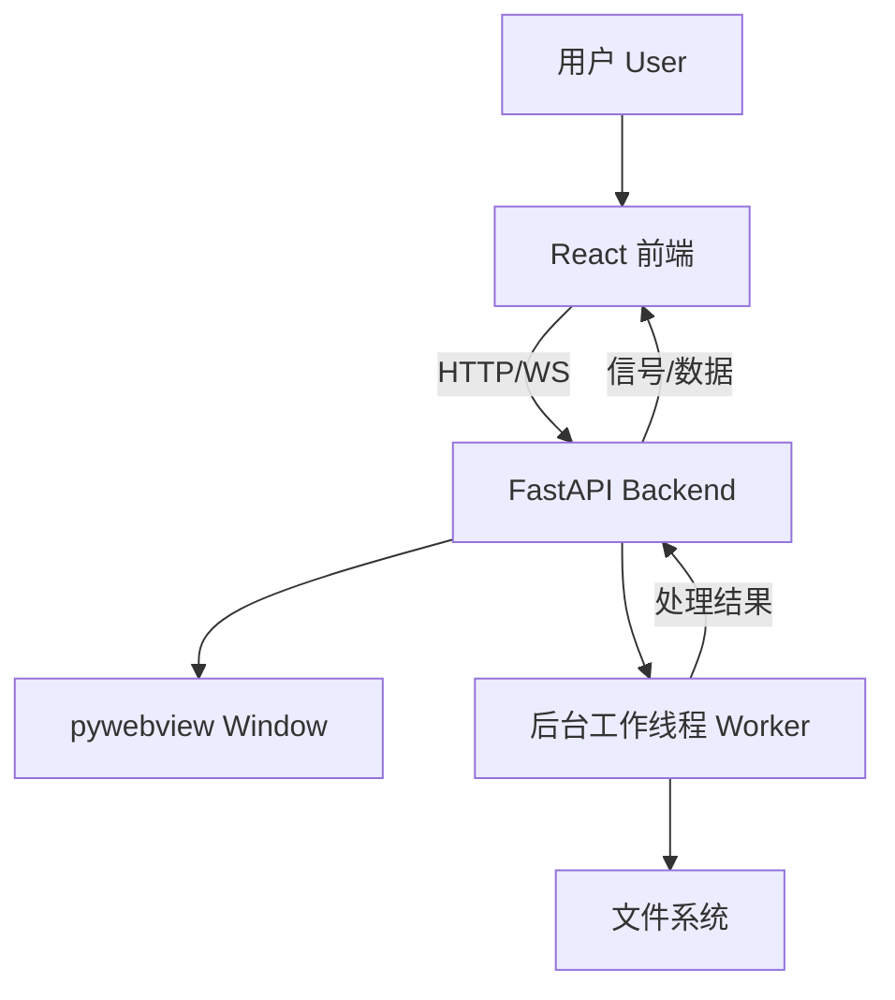

# LogLayer 项目设计文档

## 1. 核心架构 (Core Architecture)

LogLayer 采用 **前后端分离 (Frontend-Backend Separation)** 的桌面应用架构。

*   **前端 (Frontend)**: 使用 React + TypeScript + Vite 构建。负责 UI 展示、用户交互、图层配置。
*   **后端 (Backend)**: 使用 Python + FastAPI + pywebview 构建。负责文件 I/O、核心日志处理算法、插件系统、以及与操作系统的交互。
*   **通信桥梁 (The Bridge)**: 前后端通过 `WebSocket` (实时信号) + `HTTP REST API` (大数据传输) 进行通信。

### 架构图

## 2. 核心概念：图层 pipeline (Layer Pipeline)

LogLayer 的核心理念是**"图层" (Layers)**。日志处理不是一次性的，而是通过一系列图层的叠加来实现。

### 处理阶段 (Stages)
每一行日志都会经过以下处理流水线：

1.  **原生层 (NATIVE Stage)**:
    *   **工具**: `ripgrep` (rg)。
    *   **作用**: 极速过滤。利用 Rust 编写的 rg 进行正则匹配，快速筛选出感兴趣的行。
    *   **示例**: FilterLayer (关键词过滤), LevelLayer (等级过滤)。

2.  **逻辑层 (LOGIC Stage)**:
    *   **工具**: Python。
    *   **作用**: 复杂逻辑处理。对通过 Native 层的行进行精细化操作，如时间范围判断、内容替换、提取特定字段。
    *   **示例**: TimeLayer (时间范围), ReplaceLayer (内容替换)。

3.  **装饰层 (DECOR Stage)**:
    *   **工具**: Python / Frontend。
    *   **作用**: 视觉增强。不改变内容，只改变显示样式（颜色、背景）。
    *   **示例**: HighlightLayer (高亮)。

## 3. 模块划分

### 3.1 前端 (Frontend) `frontend/src/`
*   `components/`: UI 组件 (LogViewer, LayersPanel 等)。
*   `hooks/`: 逻辑钩子 (useBridge, useFileManagement)。
*   `bridge_client.ts`: 与后端通信的客户端封装。
*   `types.ts`: 类型定义，确保前后端数据结构一致。

### 3.2 后端 (Backend) `backend/`
*   `main.py`: 程序入口。启动 PyQt 应用和 WebView。
*   `bridge.py`: **核心文件**。定义 `FileBridge` 类，暴露给前端的方法 (API)。管理 `PipelineWorker` 和 `StatsWorker`。
*   `loglayer/core.py`: 定义图层基类 (`BaseLayer`, `NativeLayer`)。
*   `loglayer/builtin/`: 内置图层实现。
*   `loglayer/registry.py`: 图层注册表，负责加载和管理所有图层。

## 4. 数据流向示例 (Data Flow)

**场景：用户添加一个"关键词过滤"图层**

1.  **Frontend**: 用户在 UI 输入关键词 "Error"。
2.  **Frontend**: 调用 `bridge_client.sync_layers(config)`。
3.  **Backend (`bridge.py`)**:
    *   接收配置。
    *   终止当前的 `PipelineWorker`。
    *   实例化新的图层对象列表。
    *   启动新的 `PipelineWorker`。
4.  **Backend (`PipelineWorker`)**:
    *   构建 `ripgrep` 命令 (例如 `rg -F "Error" ...`)。
    *   执行命令，流式读取结果。
    *   对每一行应用 `LOGIC` 和 `DECOR` 图层处理。
    *   将结果分批缓存/发送。
5.  **Frontend**: 收到 `pipelineFinished` 或 `read_processed_lines` 的数据，更新 UI。

## 5. 扩展性设计

系统支持 Python 插件。
*   用户可以在指定目录编写 `.py` 文件。
*   继承 `BaseLayer` 类。
*   `registry.py` 会自动发现并加载这些类。
*   前端会根据 Python 类中定义的 `inputs` 自动生成配置表单 (Dynamic UI)。
